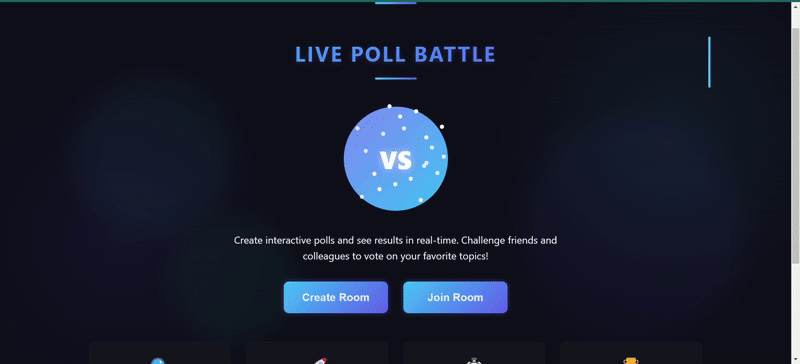
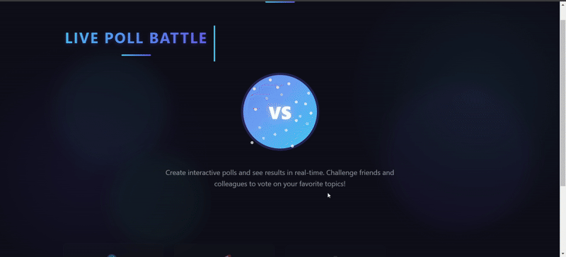

# Live Poll Battle

## Overview
Live Poll Battle is a real-time polling application that allows users to create or join a poll room and vote on one of two options. The results update instantly across all users in the same room, providing an engaging and interactive experience.


 

## Features
- **User Authentication**: Users can enter their name (unique) to create or join a poll room.
- **Poll Creation**: Users can create a new poll room or join an existing one using a room code.
- **Voting Options**: Users can vote on two options (e.g., "Cats vs Dogs") and see real-time updates of the vote counts.
- **Vote Prevention**: Once a user has voted, they cannot change their vote.
- **Countdown Timer**: Voting ends after 60 seconds, and the room is disabled for further voting.
- **Session Storage**: User votes are persisted across page refreshes using session storage.
- **Real-time Updates**: Vote counts update instantly across all connected clients.
- **Visual Animations**: Engaging UI with animations and visual feedback.

## Tech Stack
- **Frontend**: ReactJS
- **Backend**: NodeJS with WebSockets
- **Styling**: Custom CSS with animations

## Project Structure
```
live-poll-battle
├── client
│   ├── public
│   ├── src
│   ├── package.json
│   └── README.md
├── server
│   ├── src
│   ├── package.json
│   └── README.md
└── README.md
```

## Setup Instructions

### 1.root
1. Install dependencies:
   ```
   npm install
   ```
### 2.Client
1. Navigate to the `client` directory.
   cd client
2. Install dependencies:
   ```
   npm install
   ```
### 3.Server
1. Navigate to the `server` directory.
   cd server
2. Install dependencies:
   ```
   npm install
   ```
### 4.Start the application
1. Return to root directory
   cd ..

2. Start both client and server
npm start

## How It Works

1. **Create a Poll**: Enter your name and create a poll with two options.
2. **Share the Room Code**: Share the generated room code with friends.
3. **Vote**: Participants join using the room code and vote for their preferred option.
4. **Watch Results**: See real-time results as votes come in.
5. **See the Winner**: After 60 seconds, voting ends and the winner is displayed.

## Architectural Decisions
The application uses WebSockets for real-time communication between the client and server. The server maintains the state of each poll room in memory, allowing for quick updates and broadcasts to all connected clients. The frontend manages user interactions and displays real-time updates using React's state management.

## Conclusion
Live Poll Battle is designed to provide a fun and interactive way for users to engage in polls. The combination of React for the frontend and NodeJS with WebSockets for the backend allows for a seamless real-time experience.